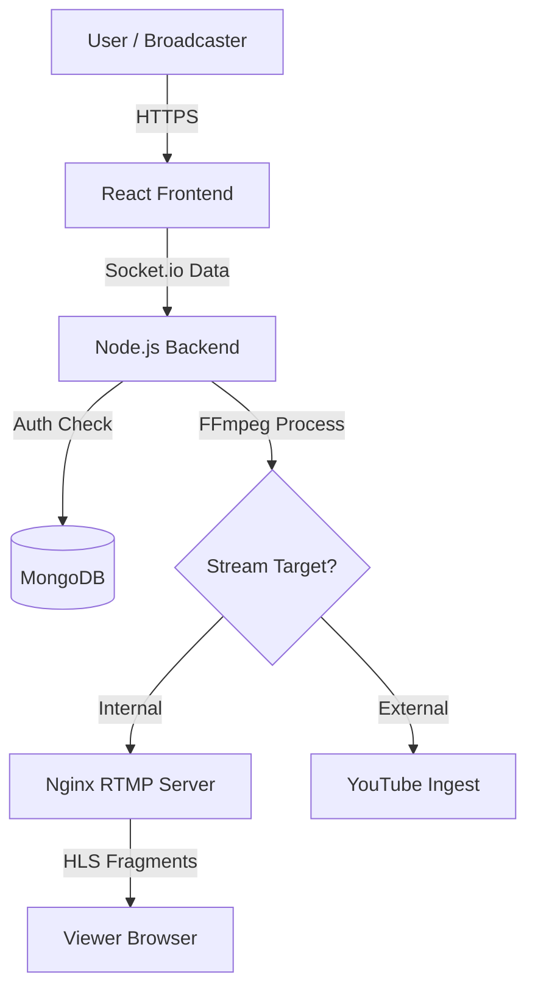
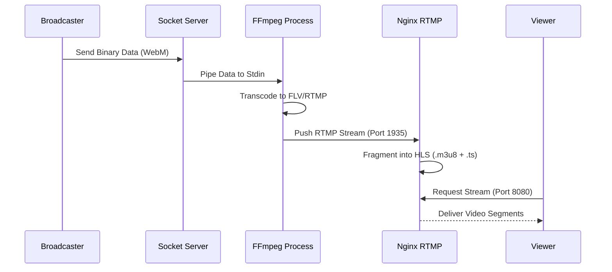

# StreamHub

A web-based live streaming platform that allows users to broadcast video directly from their browser. The application supports streaming to external platforms like YouTube as well as an internal RTMP server with HLS playback capabilities. It utilizes a React frontend, a Node.js backend for stream processing via FFmpeg, and an Nginx server for RTMP handling.

---

## Features

- **User Authentication:** Secure signup and login functionality using JWT (JSON Web Tokens) stored in HTTP-only cookies.
- **Browser-Based Streaming:** Captures video and audio directly from the user's browser using the MediaRecorder API.
- **Real-Time Transcoding:** The backend utilizes FFmpeg to convert browser input streams into RTMP format in real-time.
- **YouTube Integration:** Direct streaming support to YouTube Live via stream keys.
- **Internal Streaming Server:** A dedicated Nginx RTMP container to host and distribute streams locally.
- **HLS Playback:** Support for HTTP Live Streaming (HLS) to watch active streams within the application.

---

## Architecture & Data Flow

### 1. System Overview


### 2. Internal Streaming Flow
This flow describes how video moves from the broadcaster's camera to a viewer on StreamHub.



---

## Tech Stack

**Frontend**
- React (Vite)
- TailwindCSS
- Socket.io-client
- Zustand (State Management)
- Hls.js (Video Player)

**Backend**
- Node.js + Express.js
- Socket.io
- Fluent-FFmpeg / Child Process Spawn
- MongoDB (Mongoose)

**Infrastructure**
- Nginx (with RTMP module)
- Docker & Docker Compose

---

## Prerequisites

Before running the application, ensure you have the following installed:

- Node.js (v18 or higher)
- Docker and Docker Compose
- MongoDB (if running locally without Docker)

---

## Configuration

You must create a `.env` file in the `backend` directory. Use the following template:

**File:** `backend/.env`

```bash
MONGODB_URI=your_mongodb_connection_string
JWT_SECRET=your_secure_jwt_secret_key
NODE_ENV=development
```

---

## Installation and Setup

### Method 1: Using Docker Compose (Recommended)

This method sets up the Backend, RTMP Server, and required networking automatically.

1. Clone the repository and navigate to the root.
2. Build and start the services:

```bash
docker-compose up --build
```

3. Once running, start the frontend separately (local development):

```bash
cd frontend
npm install
npm run dev
```

### Method 2: Manual Installation

If you prefer to run services individually without Docker Compose, follow these steps.

**1. RTMP Server**
The RTMP server relies on Nginx with the RTMP module. It is highly recommended to run this via Docker even if the rest of the app is local.

```bash
cd rtmp_server
docker build -t rtmp-server .
docker run -p 1935:1935 -p 8080:80 rtmp-server
```

**2. Backend**
Ensure FFmpeg is installed on your host system before running the backend manually.

```bash
cd backend
npm install
npm start
```

**3. Frontend**

```bash
cd frontend
npm install
npm run dev
```

---

## Usage

1. **Access the App:** Open your browser and navigate to `http://localhost:5173`.
2. **Authentication:** Create an account or sign in.
3. **Start Streaming:**
   - **YouTube:** Navigate to "Stream to YouTube," enter your YouTube Stream Key, and click start.
   - **StreamHub:** Navigate to "Stream on StreamHub," enter a custom stream name, and click start.
4. **Watch Stream:** If streaming to StreamHub, a playback link will be generated (e.g., `http://localhost:5173/watchstream/[stream-name]`).

---

## Project Structure

```text
backend/                # Node.js Express API & Socket.io server
├── src/
│   ├── controllers/    # Route logic
│   ├── lib/            # Database and utils
│   ├── middlewares/    # Auth middleware
│   ├── models/         # Mongoose models
│   └── routes/         # API routes
└── index.js            # Entry point & Socket logic

frontend/               # React Vite application
├── src/
│   ├── components/     # Reusable UI components
│   ├── pages/          # Application views
│   ├── store/          # Zustand state store
│   └── lib/            # Axios configuration

rtmp_server/            # Nginx RTMP configuration
├── nginx.conf
└── Dockerfile

docker-compose.yml      # Container orchestration
```

---

## Port Allocation

- **Frontend:** 5173 (Default Vite port)
- **Backend:** 3000
- **RTMP Ingest:** 1935
- **HLS Stream Output:** 8080 (Mapped from container port 80)
